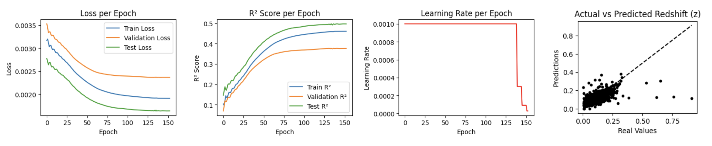

# Kicking the KAN with Photometric Redshifts (Photo-zs)

  

# Motivation

Kolmogorov-Arnold Networks (KANs) introduce a novel neural network architecture by replacing fixed activation functions on nodes with **learnable activation functions** on the edges between nodes. This approach offers:

- **Enhanced performance** relative to traditional neural networks (NNs).
- **Interpretability**: KAN models can be converted into analytic expressions, similar to symbolic regression (SR).

This project explores KANs for **photometric redshift extraction**, a critical challenge in astronomy, where the goal is to infer the redshift of astronomical objects using only broad-band photometry. The complex and non-linear mapping between observed photometric data and redshift may benefit from the flexibility and interpretability that KANs offer.

# Problem overview: Photometric redshift extraction

In astronomy, **photometric redshift extraction** involves predicting the redshift of objects using only broad-band photometric data. The mapping from photometric data to redshift is highly complex and non-linear. Traditional approaches such as Multi-Layer Perceptrons (MLPs) can struggle with this complexity, so we propose KANs as a potential improvement.

The key question: **Are KANs more efficient, interpretable, and accurate than traditional MLPs or Simbolic Regression?**

# Main goal

The main objective of this project is to evaluate the practicality and utility of KANs for **photometric redshift prediction** and compare their performance against:

- **Multi-Layer Perceptron (MLP)**
- **Symbolic Regression (SR)**
- **Kolmogorov-Arnold Networks (KAN)**

Performance is measured using two key metrics: **R² (coefficient of determination)** and **Mean Squared Error (MSE)**.

# Data source

The data used for this project comes from **Sloan Digital Sky Server V (SDSS DR18)**.

## Key data insights:

- A total of 19,870 observations. 
- Each variable distribution can be approximated to be gaussian (~normal).
- A high frequency of data is observed for **small redshifts (0 ≤ z ≤ 0.2)**.

# Model frameworks

## 1. **MLP Model**

- **Structure**:
- Input: 5 features 
- Hidden layers: 
  * 1st layer - 64 neurons
  * 2nd layer - 32 neurons
- Output: 1 neuron (prediction)
- Activation function: ReLU (hidden layers)
  
- **Training**:
  - Loss function: Mean Squared Error (MSE)
  - Optimizer: Adam (learning rate: 0.001)
  - Hardware: GPU (if available)

- **Results**:
  - R²: 0.44
  - Best MSE: 0.0024

  

  

## 2. **Symbolic Regression (SR)**

- **Tool**: PySR (symbolic regression for Python/Julia)
  
- **Data Handling:**
  - Redshift binning to mitigate unbalanced data
  - Uniform normalization of features to [-1, 1]

- **Results**:
  - Non-Uniform Data:
    - R²: 0.41
    - MSE Best: 0.0022
  - Uniform Data:
    - R²: 0.58
    - MSE Best: 0.0130

  

  
## 3. **KAN Model**

- **Structure**:
  - Width: [5, 2, 1] (input, hidden, output layers)
  - Grid size: 3, k-value: 3
  - Trainable parameters: 144
    
- **Training**:
  - Loss function: Mean Squared Error (MSE)
  - Optimizer: AdamW (learning rate: 0.001)
  - Learning Rate scheduler.

- **Results**:
  - R²: 0.42
  - Best MSE: 0.0022

  

# Summary statistics

| Model  | R²   | Best MSE |
|--------|------|----------|
| MLP    | 0.44 | 0.0024   |
| SR     | 0.41 | 0.0022   |
| KAN    | 0.42 | 0.0022   |

# Conclusions

In addressing the central question of whether Kolmogorov-Arnold Networks (KANs) are more efficient, interpretable, and accurate than traditional Multi-Layer Perceptrons (MLPs) for photometric redshift extraction, our results indicate that while the KAN model demonstrates a reasonable predictive capability, there is room for improvement. **The KAN, SR, and MLP models demonstrate similar performance.** All models achieve validation MSE values below 10⁻², with R² scores around 0.4.

# Future directions

This work opens up multiple avenues for future exploration:

- Address the challenges posed by unbalanced data.
- Incorporate higher-quality data from SDSS DR18 and beyond.
- Optimize hyperparameters.
- Investigate deeper and wider KAN architectures.
- Explore **multi-KAN models** to improve generalization.

//
----------------------------------------------------------------------------------------

# Latest results

In the latest experiment, a total of 19,870 entries were used, with five input features: **['U-G', 'G-R', 'R-I', 'I-Z', 'U-Z']**, and one target variable: **redshift**. After visualizing the distribution of the redshift values using a boxplot and histogram, outliers were identified and removed based on upper and lower bounds. The remaining data was split into training, validation, and test sets, resulting in the following data sizes:

* **Training Set   :** 13,678 samples
* **Validation Set :** 2,931 samples
* **Test Set       :** 2,932 samples

The previously implemented KAN model, with a configuration of **[5, 2, 1], k=3, and dim=3**, was trained to predict the redshift values.
This time, the model achieved the following performance metrics:

- **Results for test**:
  - R² : 0.58
  - Best MSE : 0.0108
    
- **Results for validation**:
  - R² : 0.55
  - Best MSE : 0.0110

  

Despite the fact that the KAN model architecture remained unchanged throughout this experiment, the results indicate that significant improvements can still be achieved through better data management practices. The observed performance metrics suggest that further enhancements to the dataset, could lead to more accurate predictions of redshift values. **Future work should focus on these preprocessing techniques to optimize the dataset and ultimately improve model efficacy before anything else.**

